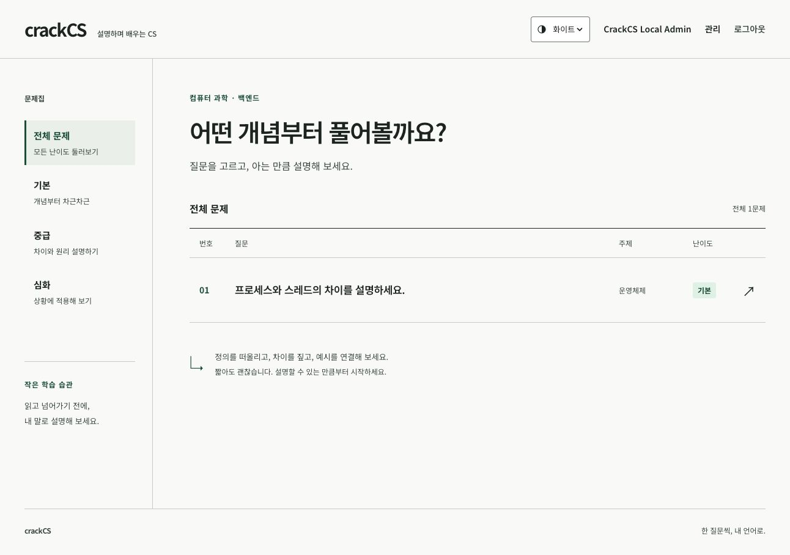

# CrackCS

**CS 개념을 읽는 데서 그치지 않고, 내 말로 설명하고 이해도를 확인하는 서술형 학습 서비스**

문제에 답하면 평가 결과와 참고 문서의 근거를 확인하고, 부족한 개념을 지식 지도와 후속 질문으로 이어서 학습할 수 있습니다.

> 현재 상태: 로컬 시연 가능. 기본 실행은 비용이 들지 않는 모의 평가를 사용하며, 실제 GPT 평가는 별도로 활성화해야 합니다. 콘텐츠의 사람 검수, 참가자 파일럿, 공개 배포는 아직 진행하지 않았습니다.



## 왜 만들었나요?

CS 개념을 읽고 이해했다고 느껴도, 면접 질문 앞에서 원리를 자기 언어로 설명하기는 어렵습니다. 답변을 마친 뒤에도 어느 개념이 약한지, 무엇을 다시 공부해야 하는지 알기 쉽지 않습니다.

CrackCS는 **서술형 답변 → 근거가 있는 평가 → 개념별 학습 상태 → 다음 질문**을 하나의 흐름으로 연결합니다.

```text
문제 선택 → 내 말로 답변 → 평가 결과와 근거 확인
                               ↓
                    지식 지도 확인 → 후속 질문 또는 다음 문제
```

## 무엇을 할 수 있나요?

| 사용자 | 기능 |
|---|---|
| 학습자 | 난이도별 문제 탐색, 서술형 답변 제출, 답변·평가 이력 조회 |
| 학습자 | 개념별 판정과 참고 근거 확인, 지식 지도 조회, 후속 질문 풀이 |
| 관리자 | 주제·개념·지식 문서·문제 관리, 공개 상태 관리, 평가 실패 검토 |

답변을 제출하면 먼저 저장하고 평가를 비동기로 처리합니다. 평가가 끝나면 판정과 근거가 답변 상세에 표시됩니다. [실제 GPT를 연결한 로컬 사용자 흐름과 시연 영상](docs/changes/2026-09-29-openai-completion/verification.md#실제-사용자-흐름과-시연)을 볼 수 있습니다.

## 어떻게 동작하나요?

```text
Vue 화면 ──HTTP──> Spring Boot API ──> 답변 저장 ──> PostgreSQL
                       │                    │
                       │                평가 작업 등록
                       │                    ↓
                       └<── 결과 조회 ── 평가 Worker
                                          │
                              문서 검색 → 평가 Port
                                          │
                         판정·근거·개념별 학습 상태 저장
```

- **답변 접수:** 같은 요청 ID로 재전송하면 기존 답변을 돌려줘 중복 저장을 막습니다.
- **평가 처리:** DB lease로 작업을 선점하고, 외부 평가 호출은 트랜잭션 밖에서 실행합니다. 결과와 학습 상태는 함께 반영합니다.
- **평가 근거:** 공개된 지식 문서를 검색해 평가에 사용하고, 문서가 교체되어도 과거 평가의 근거 버전을 보존합니다.
- **역할 분리:** 도메인 객체가 상태 규칙을 지키고, Service는 저장·트랜잭션·외부 Port 호출 순서를 조정합니다.

자세한 관계와 결정 이유는 [도메인 모델·ERD](docs/architecture/domain-model-and-erd.md), [평가 실행 결정](docs/adr/0005-phase-5-evaluation-runtime.md)에 정리했습니다.

## 기술 스택

| 영역 | 기술 |
|---|---|
| 프런트엔드 | Vue 3, TypeScript, Vite, Vitest |
| 백엔드 | Java 21, Spring Boot 4.1, Spring Security, Spring Data JPA |
| 데이터·검증 | PostgreSQL 17, H2, Testcontainers, JUnit |
| 선택적 AI 평가 | OpenAI Responses API |

실제 의존성 버전은 [Gradle 설정](build.gradle), [프런트 패키지](front/package.json), [스택 문서](docs/engineering/stack-docs.md)를 기준으로 합니다.

## 로컬에서 실행하기

**필요한 도구:** Java 21, Node.js 24, npm 11 이상, Docker Compose. Gradle은 저장소의 Wrapper를 사용합니다.

1. PostgreSQL과 백엔드를 실행합니다.

   ```bash
   bash scripts/local-postgres.sh start
   ./gradlew bootRun --args='--spring.profiles.active=local,local-postgres'
   ```

2. 다른 터미널에서 프런트엔드를 실행합니다.

   ```bash
   cd front
   npm ci
   npm run dev -- --host 127.0.0.1 --strictPort
   ```

3. `http://127.0.0.1:5173`에 접속해 회원가입한 뒤 **문제집 → 답변 제출 → 평가·근거 → 지식 지도** 순서로 살펴봅니다. 관리자 화면은 로컬 전용 계정 `admin@crackcs.local` / `local admin passphrase`로 확인할 수 있습니다.

첫 실행에는 예시 데이터가 생성되고, 재시작해도 PostgreSQL 데이터는 유지됩니다. 이 계정과 설정은 로컬 시연용입니다. 기존 V001 데이터베이스를 사용한다면 [V002 적용 절차](docs/changes/2026-09-27-release-readiness/local-runbook.md#기존-v001-db에-v002-적용)를 먼저 확인하세요. 종료·백업·복구와 실제 GPT 활성화 방법도 [로컬 실행 안내](docs/changes/2026-09-27-release-readiness/local-runbook.md)에 있습니다.

Docker 없이 화면을 개발할 때는 별도 파일 H2를 사용하는 `./gradlew bootRun --args='--spring.profiles.active=local'`을 실행할 수 있습니다.

## 검증하기

```bash
./gradlew test postgresTest --console=plain
python3 -m unittest discover -s scripts -p 'test_content_bundle.py'
python3 scripts/content_bundle.py
cd front
npm test
npm run build
```

`postgresTest`는 Docker가 필요합니다. 마지막 기록에는 백엔드 508개, PostgreSQL 통합 65개, 프런트 326개 테스트가 통과했습니다. 이는 [실제 GPT 연결 당시의 검증 결과](docs/changes/2026-09-29-openai-completion/verification.md)이며, 현재 체크아웃에서 다시 실행한 결과를 뜻하지 않습니다.

## 현재 범위와 문서

- 기본 평가는 모의 응답입니다. 실제 GPT는 별도 API 키와 지출 한도를 설정한 로컬 시연에서 확인했습니다.
- 초기 콘텐츠는 25문항·50개 개념·5개 문서의 **사람 검수 전 초안**입니다. 자동으로 공개하지 않습니다. [콘텐츠 안내](docs/content/initial-v1/README.md)
- 공개 서비스 운영, 실제 참가자 파일럿, 운영 부하와 공유 세션은 검증 범위 밖입니다. [현재 작업 상태](docs/planning/tasks.md)
- 기능과 HTTP 계약: [제품 명세](docs/product/spec.md) · [OpenAPI](openapi.yml)
- 개발·검증 문서: [문서 지도](docs/README.md) · [협업 규칙](AGENTS.md)
