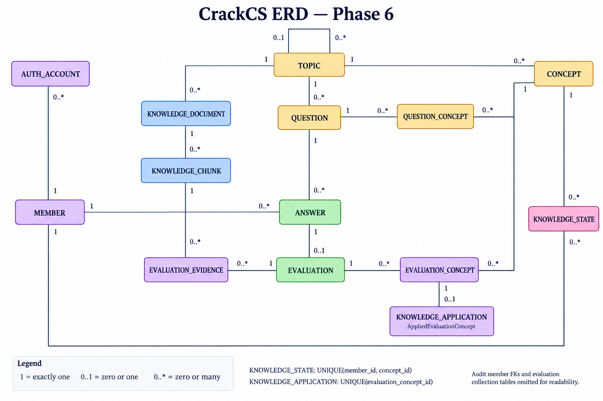

# CrackCS 필수 도메인 모델 및 테이블 설계

## 1. 도메인 모델

```text
Member
 ├─ AuthAccount
 ├─ Answer ── Evaluation ── EvaluationConcept
 │     │                            │
 │     └─ Question                  ▼
 │              │                Concept
 │              └─ QuestionConcept ─┘
 │
 └─ KnowledgeState ─────────────── Concept

Topic
 ├─ Concept
 ├─ Question
 └─ KnowledgeDocument ── KnowledgeChunk

Answer ──▶ Follow-up Question
```

## 2. 객체별 책임

### Member

- 회원 기본 정보, 권한과 상태를 가진다.
- `USER`와 `ADMIN` 역할을 구분한다.
- 답변 평가나 추천 규칙까지 담당하지 않는다.

### AuthAccount

- Member가 어떤 방식으로 로그인하는지 관리한다.
- 최초에는 `LOCAL` 제공자의 이메일과 비밀번호 해시를 가진다.
- Member와 인증 정보를 분리하여 추후 소셜 로그인 계정을 연결할 수 있게 한다.

```text
Member = 서비스 안에서 누구인가?
AuthAccount = 그 Member임을 어떻게 증명하는가?
```

비밀번호 원문은 어느 객체에도 저장하지 않는다.

### Topic

- 운영체제, 네트워크, 데이터베이스와 같은 큰 학습 영역이다.
- 여러 Concept, Question, Knowledge Document를 묶는다.

### Concept

- 평가와 학습 상태를 관리하는 최소 지식 단위이다.
- 예: `TCP 신뢰성`, `트랜잭션 격리성`, `프로세스와 스레드`

### KnowledgeDocument / KnowledgeChunk

- KnowledgeDocument는 평가 근거 원문의 제목, 출처, 기술 버전과 검수 상태를 가진다.
- KnowledgeChunk는 Retrieval을 위해 원문을 나눈 검색 단위이다.

### 관리자

- 별도 Admin 엔티티를 만들지 않고 `Member.role = ADMIN`으로 표현한다.
- 관리자는 Topic, Concept, KnowledgeDocument와 Question을 등록하고 검수한다.
- 관리자 페이지는 애플리케이션 계층에서 관리자 권한을 확인한 뒤 관리 기능을 제공한다.

### Question

- 서술형 문제 본문, 관리자가 지정한 난이도와 모범 답안을 가진다.
- 일반 문제와 후속 질문을 같은 객체로 표현한다.
- 후속 질문이면 자신을 생성하게 만든 원본 Answer를 참조한다.

### QuestionConcept

- Question과 Concept의 다대다 관계를 해결한다.
- 문제에서 각 Concept이 얼마나 중요한지 가중치를 가진다.

### Answer

- 회원이 특정 문제에 제출한 답변 원문이다.
- 같은 문제를 다시 풀면 기존 Answer를 수정하지 않고 새 Answer를 만든다.
- 제출 이후에는 과거 사실이므로 내용을 변경하지 않는다.

### Evaluation

- Answer 하나에 대한 종합 평가이다.
- 정오 판정, 판정으로부터 계산한 단순 점수, 종합 피드백과 평가 성공 여부를 가진다.

### EvaluationConcept

- Evaluation을 Concept별로 분해한 결과이다.
- 개념별 점수, 취약 여부, 피드백을 가진다.

### KnowledgeState

- 회원과 Concept 조합별 누적 이해 상태이다.
- 숙련도, 신뢰도, 평가 횟수를 가진다.
- 평가 이력인 EvaluationConcept와 달리 현재 상태를 나타낸다.
- 성공한 개념 평가를 받아 자신의 숙련도를 갱신하는 책임을 가진다.

```text
EvaluationConcept = 그 시점의 평가 기록
KnowledgeState    = 여러 평가를 누적한 현재 상태
```

### 도메인 서비스

여러 객체의 정보가 함께 필요한 결정은 한 엔티티에 억지로 넣지 않고 서비스가 조율한다.

| 서비스                           | 책임                                           |
|-------------------------------|----------------------------------------------|
| AuthenticationService         | 이메일·비밀번호 검증과 AuthAccount 인증                |
| ContentReviewService          | 관리자 권한을 확인하고 문서·문제의 공개 상태 전환             |
| KnowledgeRetrievalService     | 질문과 답변에 관련된 KnowledgeChunk 검색                |
| AnswerEvaluationService       | 검색 근거와 QuestionConcept 기준으로 Evaluation 생성    |
| KnowledgeStateService         | 성공한 EvaluationConcept를 해당 KnowledgeState에 반영 |
| FollowUpQuestionService       | 취약 또는 심화 Concept을 골라 후속 Question 생성          |
| QuestionRecommendationService | 회원의 KnowledgeState를 비교해 다음 Question 선택       |

```text
Learning use case
      │
      ├─ 검색은 KnowledgeRetrievalService에게
      ├─ 평가는 AnswerEvaluationService에게
      ├─ 현재 상태 변경은 KnowledgeState에게
      └─ 다음 문제 결정은 QuestionRecommendationService에게 요청
```

평가, 상태 계산, 추천을 한 객체에 모두 넣으면 평가 모델 변경이 추천 코드까지 흔든다. 서로 다른 변경 이유를 가진 책임을 분리하면 각 규칙을 독립적으로 시험하고 교체할 수 있다.

## 3. ERD



Cardinality 표기는 관계선 가까이에 있는 엔티티가 아니라 반대편 엔티티 한 건을 기준으로 읽는다.

```text
ANSWER |o--o| QUESTION
       ▲      ▲
       │      └─ Answer 하나는 후속 Question을 0개 또는 1개 만들 수 있음
       └─ Question 하나의 source Answer는 0개 또는 1개
```

일반 Question은 `source_answer_id = NULL`, 후속 Question은 `source_answer_id = Answer.id`이므로 왼쪽은 `|o`다. 답변 하나당 후속 질문을 최대 한 개만 허용하므로 오른쪽도 `o|`이며, 이 규칙은 `QUESTION.source_answer_id`의 UNIQUE 제약으로 DB에서도 보장한다.

`QUESTION`과 `EVALUATION`은 생명주기에 따라 하위 행의 최소 개수가 달라진다. Mermaid ERD에는 저장 가능한 전체 상태를 표현하기 위해 `o{`를 사용하고, 공개·평가 완료 시점의 더 강한 조건은 도메인 불변식으로 강제한다.

```text
DRAFT Question       → QuestionConcept 0개 이상
PUBLISHED Question   → QuestionConcept 1개 이상
EVALUATING/FAILED    → EvaluationConcept 0개 이상
EVALUATED Evaluation → 모든 필수 QuestionConcept의 EvaluationConcept 존재
```

## 4. 테이블 설계

### MEMBER

| 컬럼 | 타입 | 제약 | 설명 |
|---|---|---|---|
| id | BIGINT | PK | 회원 ID |
| nickname | VARCHAR(100) | NOT NULL | 표시 이름 |
| role | VARCHAR(20) | NOT NULL | USER, ADMIN |
| status | VARCHAR(20) | NOT NULL | ACTIVE, BLOCKED, WITHDRAWN |
| created_at | TIMESTAMP | NOT NULL | 등록 일시 |
| updated_at | TIMESTAMP | NOT NULL | 수정 일시 |

### AUTH_ACCOUNT

| 컬럼 | 타입 | 제약 | 설명 |
|---|---|---|---|
| id | BIGINT | PK | 인증 계정 ID |
| member_id | BIGINT | FK → MEMBER, NOT NULL | 연결된 회원 |
| provider | VARCHAR(30) | NOT NULL | 최초에는 LOCAL |
| login_id | VARCHAR(255) | NOT NULL | LOCAL에서는 이메일 |
| password_hash | VARCHAR(255) | NOT NULL | 단방향 비밀번호 해시 |
| last_login_at | TIMESTAMP | NULL | 마지막 로그인 일시 |
| created_at | TIMESTAMP | NOT NULL | 계정 생성 일시 |

`(provider, login_id)`는 유일해야 한다. 추후 소셜 인증을 도입하면 같은 Member에 다른 provider 계정을 연결하고, 소셜 계정의 `password_hash`는 nullable로 변경한다.

### TOPIC

| 컬럼 | 타입 | 제약 | 설명 |
|---|---|---|---|
| id | BIGINT | PK | 주제 ID |
| parent_id | BIGINT | FK → TOPIC, NULL | CS 기초·백엔드 기본 같은 상위 주제 |
| code | VARCHAR(50) | UNIQUE, NOT NULL | 주제 코드 |
| name | VARCHAR(100) | NOT NULL | 주제 이름 |
| active | BOOLEAN | NOT NULL | 신규 콘텐츠 연결 가능 여부 |

### CONCEPT

| 컬럼          | 타입           | 제약                   | 설명    |
|-------------|--------------|----------------------|-------|
| id          | BIGINT       | PK                   | 개념 ID |
| topic_id    | BIGINT       | FK → TOPIC, NOT NULL | 소속 주제 |
| code        | VARCHAR(100) | UNIQUE, NOT NULL     | 개념 코드 |
| name        | VARCHAR(150) | NOT NULL             | 개념 이름 |
| description | TEXT         | NULL                 | 개념 설명 |
| active      | BOOLEAN      | NOT NULL             | 신규 콘텐츠 연결 가능 여부 |

### KNOWLEDGE_DOCUMENT

| 컬럼         | 타입            | 제약                   | 설명                        |
|------------|---------------|----------------------|---------------------------|
| id | BIGINT | PK | 문서 ID |
| topic_id | BIGINT | FK → TOPIC, NOT NULL | 소속 주제 |
| created_by_member_id | BIGINT | FK → MEMBER, NOT NULL | 등록 관리자 |
| reviewed_by_member_id | BIGINT | FK → MEMBER, NULL | 최종 검수 관리자 |
| title | VARCHAR(255) | NOT NULL | 문서 제목 |
| source_type | VARCHAR(30) | NOT NULL | OFFICIAL_SPEC, OFFICIAL_DOC, INTERNAL_SUMMARY 등 |
| source_url | VARCHAR(1000) | NULL | 원문 출처 |
| version_series_id | VARCHAR(36) | NOT NULL | 같은 논리 문서의 버전 계열 ID |
| document_version | INTEGER | NOT NULL | 내부 문서 버전 |
| technology_version | VARCHAR(100) | NULL | Java 21, Spring Boot 4.1 등 적용 범위 |
| license_note | VARCHAR(500) | NULL | 사용·인용 조건 |
| content | TEXT | NOT NULL | Phase 3 JSON 입력으로 보관하는 원문 |
| checksum | VARCHAR(128) | NOT NULL | 원문 변경 탐지 값 |
| status | VARCHAR(20) | NOT NULL | DRAFT, PUBLISHED, RETIRED |
| reviewed_at | TIMESTAMP | NULL | 최종 검수 일시 |
| created_at | TIMESTAMP | NOT NULL | 등록 일시 |
| updated_at | TIMESTAMP | NOT NULL | 최종 수정·상태 전이 일시 |

`checksum`은 줄바꿈을 LF로 통일하고 앞뒤 공백을 제거한 `content`의 SHA-256이다. `(version_series_id, document_version)`은 유일하며 같은 checksum의 원문도 중복 저장할 수 없다. 새 버전을 공개하면 같은 계열의 이전 공개본은 삭제하지 않고 `RETIRED`로 전환한다.

### KNOWLEDGE_CHUNK

| 컬럼          | 타입          | 제약                                | 설명         |
|-------------|-------------|-----------------------------------|------------|
| id          | BIGINT      | PK                                | 문서 조각 ID   |
| document_id | BIGINT      | FK → KNOWLEDGE_DOCUMENT, NOT NULL | 원본 문서      |
| sequence_no | INTEGER     | NOT NULL                          | 문서 안의 순서   |
| start_offset | INTEGER | NOT NULL | 원문 시작 위치 |
| end_offset | INTEGER | NOT NULL | 원문 끝 위치 |
| content     | TEXT        | NOT NULL                          | 검색 대상 내용   |
| checksum | VARCHAR(64) | NOT NULL | Chunk 내용 hash |
| generation_key | VARCHAR(128) | NOT NULL | 문서 checksum + 분할 정책 키 |
| chunk_policy_version | VARCHAR(30) | NOT NULL | 분할 정책 버전 |
| search_status | VARCHAR(30) | NOT NULL | KEYWORD_SEARCHABLE, EMBEDDING_PENDING, EMBEDDING_FAILED, READY |
| created_at | TIMESTAMP | NOT NULL | 생성 시각 |

`(document_id, sequence_no)`는 유일하다. 현재 키워드 기준선을 사용하며 Recall@K가 85% 미만이거나 무관 Chunk 비율이 20%를 넘을 때 pgvector를 비교한다.

### QUESTION

| 컬럼               | 타입          | 제약                   | 설명                            |
|------------------|-------------|----------------------|-------------------------------|
| id               | BIGINT      | PK                   | 문제 ID                         |
| topic_id         | BIGINT      | FK → TOPIC, NOT NULL | 소속 주제                         |
| source_answer_id | BIGINT      | UNIQUE, FK → ANSWER, NULL | 후속 질문의 원본 답변; 답변당 최대 한 개 |
| created_by_member_id | BIGINT | FK → MEMBER, NULL | 일반 문제 등록 관리자; 시스템 후속 질문은 NULL |
| reviewed_by_member_id | BIGINT | FK → MEMBER, NULL | 문제 검수 관리자 |
| origin | VARCHAR(30) | NOT NULL | ADMIN, SYSTEM_FOLLOW_UP |
| type             | VARCHAR(20) | NOT NULL             | NORMAL, FOLLOW_UP             |
| difficulty       | VARCHAR(20) | NOT NULL             | BASIC, INTERMEDIATE, ADVANCED |
| content          | TEXT        | NOT NULL             | 문제 본문                         |
| reference_answer | TEXT        | NOT NULL             | 평가용 모범 답안                     |
| version_series_id | VARCHAR(36) | NOT NULL | 같은 논리 문제의 버전 계열 ID |
| question_version | INTEGER | NOT NULL | 문제 버전 |
| status           | VARCHAR(20) | NOT NULL             | DRAFT, PUBLISHED, RETIRED     |
| reviewed_at | TIMESTAMP | NULL | 검수 완료 일시 |
| created_at       | TIMESTAMP   | NOT NULL             | 생성 일시                         |
| updated_at       | TIMESTAMP   | NOT NULL             | 최종 수정·상태 전이 일시 |

관리자가 등록한 일반 문제는 검수 후 PUBLISHED가 된다. `SYSTEM_FOLLOW_UP` 문제는 이미 검수된 원문 문제와 KnowledgeDocument를 바탕으로 특정 Answer에 대해서만 생성되므로 `created_by_member_id`와 `reviewed_by_member_id`가 NULL일 수 있다.

Question 유형과 원본 Answer는 함께 검증한다.

```text
NORMAL    → source_answer_id IS NULL
FOLLOW_UP → source_answer_id IS NOT NULL
```

`source_answer_id`의 UNIQUE 제약은 같은 Answer에 대한 후속 Question 중복 생성을 차단한다. 애플리케이션의 사전 조회만으로는 동시 요청 두 개가 모두 “없음”을 확인한 뒤 각각 생성할 수 있으므로, 최종 보장은 DB 제약이 맡아야 한다.

### QUESTION_CONCEPT

| 컬럼          | 타입           | 제약                | 설명          |
|-------------|--------------|-------------------|-------------|
| id          | BIGINT       | PK                | 문제 평가 개념 ID |
| question_id | BIGINT       | FK → QUESTION     | 문제 ID       |
| concept_id  | BIGINT       | FK → CONCEPT      | 개념 ID       |
| weight      | DECIMAL(5,2) | NOT NULL          | 문제 내 평가 가중치 |
| required    | BOOLEAN      | NOT NULL          | 필수 개념 여부    |

`id`를 엔티티 식별자로 사용하고 `(question_id, concept_id)` UNIQUE 제약으로 같은 문제에 동일한 Concept가 중복 연결되는 것을 막는다. `required`는 정답에 반드시 포함해야 하는 Concept인지 나타내고, `weight`는 여러 Concept가 평가 결과에 기여하는 상대적 비중이다. 가중치는 `(0, 1]` 범위의 소수 둘째 자리 값이며 공개 시 전체 합이 정확히 `1.00`이어야 한다. DRAFT 상태에서는 연결이 없을 수 있지만, PUBLISHED 또는 SYSTEM_FOLLOW_UP Question은 하나 이상의 QuestionConcept와 하나 이상의 필수 Concept를 가져야 한다. 이 조건은 일반 FK로 강제할 수 없으므로 공개 상태 전이와 후속 질문 생성 유스케이스에서 검증한다.

### ANSWER

Phase 4 구현 기준.

| 컬럼 | 타입 | 제약 | 설명 |
|---|---|---|---|
| id | BIGINT | PK | 답변 ID |
| member_id | BIGINT | FK → MEMBER, NOT NULL | 답변 소유자 |
| question_id | BIGINT | FK → QUESTION, NOT NULL | 제출 당시 문제 버전 |
| request_id | VARCHAR(36) | NOT NULL | Idempotency-Key 헤더의 소문자 UUID |
| content | TEXT | NOT NULL | 수정하지 않는 원문, 최대 10,000 UTF-16 코드 단위 |
| submitted_at | TIMESTAMP | NOT NULL | 제출 시각 |

- 유일 제약: `(member_id, request_id)`
- 이력 조회 인덱스: `(member_id, submitted_at)`
- 같은 회원·문제의 새 키: 새 답변 이력
- 회원 행 잠금: 같은 키 동시 요청 직렬화
- 폐기된 문제: 신규 제출 차단, 기존 이력·멱등 복구 유지

### EVALUATION

Phase 5 구현 기준.

| 컬럼 | 타입 | 제약 | 설명 |
|---|---|---|---|
| id | BIGINT | PK | 평가 ID |
| answer_id | BIGINT | UNIQUE, FK → ANSWER, NOT NULL | 대상 답변 |
| version | BIGINT | JPA @Version | 동시 수정 최종 방어 |
| status | VARCHAR(20) | NOT NULL | EVALUATING, PROCESSING, EVALUATED, NEEDS_REVIEW, FAILED |
| verdict | VARCHAR(30) | NULL | CORRECT, PARTIALLY_CORRECT, INCORRECT, NEEDS_REVIEW |
| score | INTEGER | NULL | 서버가 판정에서 계산한 100, 50, 0 또는 NULL |
| feedback | TEXT | NULL | 종합 피드백 |
| failure_reason | TEXT | NULL | 안전한 진단 코드 |
| created_at | TIMESTAMP | NOT NULL | 평가 접수 시각 |
| updated_at | TIMESTAMP | NOT NULL | 마지막 상태 변경 시각 |
| evaluated_at | TIMESTAMP | NULL | 완료·실패 확정 시각 |
| attempt_count | INTEGER | NOT NULL | lease 획득 횟수 |
| next_attempt_at | TIMESTAMP | NOT NULL | 다음 재시도 가능 시각 |
| lease_owner | VARCHAR(100) | NULL | 현재 worker |
| lease_expires_at | TIMESTAMP | NULL | 재수령 가능 시각 |
| model_name | VARCHAR(100) | NULL | 실제 평가 모델 |
| evaluator_version | VARCHAR(100) | NULL | 평가 규칙 버전 |
| processing_duration_millis | BIGINT | NULL | provider 처리 시간 |
| input_tokens | BIGINT | NULL | 비용 계산 입력 token |
| output_tokens | BIGINT | NULL | 비용 계산 출력 token |

- Answer + EVALUATING 생성: 같은 제출 트랜잭션
- 평가 처리: lease 획득 → 트랜잭션 밖에서 1회 Port 호출 → 실패 시 지수 backoff 예약 → 최대 3회
- NEEDS_REVIEW: 별도 terminal 상태, score=NULL
- 필수 Concept NEEDS_REVIEW: 전체 verdict도 NEEDS_REVIEW만 허용
- FAILED·전체 NEEDS_REVIEW: Knowledge State 반영 대상 제외
- 작업 재탐색: DB의 EVALUATING 행; 메모리 이벤트에 의존하지 않음
- 대기 조회 인덱스: `(status, created_at)`
- 중복 호출: 평가 ID별 로컬 직렬화 + DB lease 소유권 확인

### EVALUATION_CONCEPT

Phase 4 구현 기준.

| 컬럼 | 타입 | 제약 | 설명 |
|---|---|---|---|
| id | BIGINT | PK | 결과 ID |
| evaluation_id | BIGINT | FK → EVALUATION, NOT NULL | 평가 ID |
| concept_id | BIGINT | FK → CONCEPT, NOT NULL | 평가 대상 개념 |
| verdict | VARCHAR(30) | NOT NULL | 개념별 판정 |
| score | INTEGER | NULL | 서버 판정 점수 |
| feedback | TEXT | NOT NULL | 개념별 피드백 |

- 유일 제약: `(evaluation_id, concept_id)`
- API 응답: Concept ID와 현재 참조 Concept 이름 제공
- EVALUATING·FAILED: 결과 없음
- EVALUATED: 문제에 연결된 모든 Concept 결과 필수; 누락·중복·추가 결과 거부
- 전체 CORRECT: 모든 필수 Concept CORRECT 필요
- 전체 입력 검증 후 필드·시각 변경; 검증 실패 시 부분 수정 없음
- 강점·누락·오개념: 별도 element collection 저장

### EVALUATION_EVIDENCE

| 컬럼              | 타입           | 제약                       | 설명            |
|-----------------|--------------|--------------------------|---------------|
| id | BIGINT | PK | 연결 ID |
| evaluation_id   | BIGINT       | FK → EVALUATION, NOT NULL | 평가 ID         |
| chunk_id        | BIGINT       | FK → KNOWLEDGE_CHUNK, NOT NULL | 사용한 근거 조각     |

`(evaluation_id, chunk_id)`는 유일하다. 점수는 검색 단계의 순위 결정값이며 확정 Evidence의 사실 정보가 아니므로 저장하지 않는다.

이 테이블은 AI가 어떤 KnowledgeChunk를 근거로 판단했는지 보존한다. 이 연결이 없으면 평가 결과는 남아도 그 결과가 왜 나왔는지 재현하기 어렵다.

### KNOWLEDGE_STATE

| 컬럼                | 타입           | 제약               | 설명                        |
|-------------------|--------------|------------------|---------------------------|
| member_id         | BIGINT       | PK, FK → MEMBER  | 회원 ID                     |
| concept_id        | BIGINT       | PK, FK → CONCEPT | 개념 ID                     |
| mastery_score     | DECIMAL(5,2) | NULL             | 누적 숙련도; 미평가는 NULL         |
| confidence_score  | DECIMAL(5,2) | NOT NULL         | 평가 신뢰도                    |
| attempt_count     | INTEGER      | NOT NULL         | 반영된 평가 수                  |
| status            | VARCHAR(20)  | NOT NULL         | UNKNOWN, LEARNING, STABLE |
| version           | BIGINT       | NOT NULL         | 동시 갱신 제어용 버전              |
| last_evaluated_at | TIMESTAMP    | NULL             | 마지막 평가 일시                 |
| updated_at        | TIMESTAMP    | NOT NULL         | 상태 수정 일시                  |

복합 기본 키는 `(member_id, concept_id)`이다.

## 5. 핵심 관계 설명

### Question과 Concept은 다대다

```text
한 문제 → TCP, 재전송, 흐름 제어를 함께 평가
한 개념 → 여러 난이도의 문제에서 반복 평가
```

그래서 중간 테이블 `QUESTION_CONCEPT`이 필요하다. 단순 다대다 매핑이 아니라 평가 가중치도 가지므로 독립된 도메인 객체로 보는 것이 적절하다.

### Answer와 Evaluation은 일대일

한 번 제출한 답변에는 하나의 최종 평가만 둔다. AI 재시도는 새로운 Evaluation을 만들지 않고 같은 Evaluation의 상태를 변경한다.

### EvaluationConcept와 KnowledgeState는 목적이 다르다

```text
답변 A의 TCP 점수 40 ─┐
답변 B의 TCP 점수 70 ─┼─▶ 현재 TCP KnowledgeState 61
답변 C의 TCP 점수 80 ─┘
```

- `EVALUATION_CONCEPT`: 변경하지 않는 과거 사실
- `KNOWLEDGE_STATE`: 평가 결과가 누적되면서 변경되는 현재 상태

둘을 하나로 합치면 과거 평가 이력이 사라지거나, 현재 상태 조회 때 매번 전체 이력을 다시 계산해야 한다.

### 후속 질문도 Question이다

일반 문제와 후속 질문은 답변을 받고 평가된다는 동작이 같다. 별도 테이블로 분리하지 않고 `QUESTION.type`으로 구분한다.

후속 질문만 `source_answer_id`를 가지므로 어느 답변의 취약점을 확인하기 위해 생성되었는지 추적할 수 있다.

## 6. 초기 인덱스 후보

| 테이블             | 인덱스                                  | 목적           |
|-----------------|--------------------------------------|--------------|
| AUTH_ACCOUNT    | `UNIQUE(provider, login_id)`         | 로그인 계정 중복 방지와 인증 조회 |
| ANSWER          | `(member_id, submitted_at DESC)`     | 회원별 최근 풀이 이력 |
| ANSWER          | `(question_id)`                      | 문제별 답변 조회    |
| QUESTION        | `UNIQUE(source_answer_id)`           | 답변당 후속 질문 최대 한 개 보장 |
| QUESTION        | `(topic_id, status, difficulty)`     | 추천 문제 후보 조회  |
| KNOWLEDGE_DOCUMENT | `(topic_id, status, technology_version)` | Topic별 공개 Retrieval 후보와 관리자 문서 필터 조회 |
| KNOWLEDGE_STATE | `(member_id, status, mastery_score)` | 회원별 취약 개념 조회 |
| KNOWLEDGE_CHUNK | 벡터 인덱스                               | 유사 문서 검색     |
| EVALUATION      | `(status, evaluated_at)`             | 평가 작업과 실패 조회 |

`QUESTION(topic_id, status, difficulty)`는 Topic을 먼저 정한 뒤 공개 상태와 난이도로 후보를 줄이는 추천 조회를 기준으로 한다. `KNOWLEDGE_DOCUMENT(topic_id, status, technology_version)`는 Topic별 `PUBLISHED` Retrieval 후보 조회와 관리자 화면의 기술 버전 필터를 함께 지원한다.

두 인덱스 모두 선두 컬럼인 `topic_id`가 없는 검색까지 모두 최적화하지는 않는다. 또한 선택 필터를 `OR :parameter IS NULL` 형태로 처리하거나 임의 정렬을 적용하면 DB가 인덱스를 선택하지 않을 수 있다. 현재는 제품의 주 조회 경로를 반영한 초기 후보이며, 운영 DB와 데이터 분포가 정해지면 실제 SQL의 실행 계획과 쓰기 비용을 측정해 컬럼 순서, 별도 인덱스 또는 제거 여부를 다시 결정한다.

## 7. 문서 범위

이 ERD는 이메일·비밀번호 인증, 관리자 검수, 문제 풀이, 근거 검색, AI 평가, Knowledge State 갱신, 후속 질문과 다음 문제 추천에 반드시 필요한 테이블만 포함한다.

학습 세션, 목표 설정, 추천 이력, 자동 문제 생성 이력처럼 핵심 루프 없이도 나중에 추가할 수 있는 모델은 [추가 확장 기능](../planning/extension-features.md)에서 관리한다.
