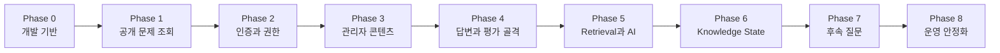

# CrackCS 개발 계획

## 1. 목적

이 문서는 `spec.md`의 P0 기능을 한 번에 구현하지 않고, 매 Phase마다 실행하고 검증할 수 있는 작은 제품을 남기는 순서로 나눈다.

핵심 원칙은 다음과 같다.

```text
정적 문제 조회
    ↓
회원과 관리자
    ↓
콘텐츠 운영
    ↓
답변과 평가 골격
    ↓
근거 기반 AI 평가
    ↓
개인 지식 상태와 추천
    ↓
후속 질문과 운영 안정화
```

이 순서가 유효한 이유는 뒤의 기능이 앞의 데이터를 필요로 하기 때문이다. 예를 들어 AI 평가는 검수된 문제와 지식 문서가 있어야 검증할 수 있고, Knowledge State는 신뢰할 수 있는 평가가 있어야 의미가 있다.

## 2. 계획의 기준

### 2.1 문서 역할

| 문서 | 책임 |
|---|---|
| `spec.md` | 무엇을 만들고 어떤 조건을 만족해야 하는지 정의 |
| `plan.md` | 어떤 순서로 만들고 각 단계에서 어떻게 검증할지 정의 |
| `domain-model-and-erd.md` | 도메인 관계와 테이블 구조 정의 |
| `content-and-ai-policy.md` | 지식 출처, 검수와 AI 운영 정책 정의 |
| `extension-features.md` | P0 이후 확장 기능 보관 |

기능 요구사항이 바뀌면 `spec.md`를 먼저 수정한다. 구현 순서만 바뀌면 `plan.md`를 수정한다.

### 2.2 단계 분리 원칙

- 각 Phase는 이전 Phase가 완료되어야 시작할 수 있다.
- 각 Phase는 백엔드, 프런트엔드, 데이터와 테스트를 함께 끝내는 수직 단위다.
- 외부 AI 없이 검증할 수 있는 흐름을 먼저 만든다.
- 임시 구현은 용도와 제거 시점을 명시한다.
- 미결정 기술은 필요한 Phase 직전에 결정한다. 너무 일찍 확정해 변경 비용을 만들지 않는다.
- P1과 확장 기능은 P0 완료 전 구현하지 않는다.

## 3. 현재 기술 기준과 도입 판단

### 3.1 이미 프로젝트에 있는 기술

| 영역 | 현재 기술 | 사용 목적 |
|---|---|---|
| Backend | Java 21, Spring Boot 4.1.1 | 애플리케이션 실행과 설정 |
| Web | Spring MVC | REST API |
| Persistence | Spring Data JPA, H2 | 로컬 데이터 저장과 통합 테스트 |
| Frontend | Vue 3.5, TypeScript 6, Vite 8 | 사용자·관리자 웹 화면 |
| UI | Element Plus, Bootstrap | 기본 UI 구성 |
| Test | JUnit Platform, Spring Boot test starters | 백엔드 단위·통합 테스트 |

### 3.2 계획에 기술 내용을 포함하는 이유

기술은 별도의 장식 목록이 아니라 기능의 실패 경계를 결정한다.

- 로그인은 Spring Security의 인증 필터와 서버 측 인가가 필요하다.
- Answer 저장과 Evaluation 생성은 트랜잭션 경계가 필요하다.
- 재시도 가능한 AI 평가는 멱등성과 비동기 실행 방식을 필요로 한다.
- Knowledge State 갱신은 동시 요청에서 유실되지 않도록 잠금 전략이 필요하다.
- 근거 검색은 운영 DB와 벡터 저장 방식에 영향을 준다.

따라서 각 Phase에는 그 기능을 구현하는 데 필요한 기술만 도입한다.

### 3.3 기술 도입 원칙

| 기술·결정 | 도입 Phase | 판단 |
|---|---:|---|
| Flyway 또는 동등한 DB migration | Phase 0 | 테이블 변경 이력을 초기부터 재현하기 위해 필요 |
| Spring Security | Phase 2 | 인증·인가가 시작될 때 도입 |
| Bean Validation | Phase 1 | API 입력 경계부터 사용 |
| 프런트 API client와 공통 오류 처리 | Phase 1 | 화면마다 HTTP 처리를 복제하지 않도록 초기 도입 |
| Testcontainers + PostgreSQL | Phase 5 이전 결정 | H2와 운영 DB 차이가 Retrieval·쿼리에 영향을 줄 때 도입 |
| PostgreSQL + pgvector | Phase 5 후보 | 문서 규모와 검색 품질 실험 후 확정 |
| 비동기 작업 방식 | Phase 5 이전 결정 | 초기에는 단순 실행기/DB 상태 기반, 필요 시 queue 검토 |
| 외부 AI SDK | Phase 5 | 평가 계약이 고정된 뒤 adapter로 연결 |
| 전역 상태 관리 라이브러리 | 필요 시 | 초기 Vue composable로 충분하면 추가하지 않음 |

## 4. 목표 아키텍처와 책임

처음부터 복잡한 프레임워크 구조를 만들지는 않지만, 비즈니스 규칙이 Controller나 AI SDK에 섞이지 않도록 의존 방향을 유지한다.

```text
Vue 화면
   ↓ HTTP
Controller ── 입력 검증과 응답 변환
   ↓
Application Service ── 유스케이스와 트랜잭션 조정
   ↓
Domain ── 상태 전이와 판정 규칙
   ↓
Repository Port / AI Port
   ↓
JPA Adapter / AI Adapter / Retrieval Adapter
```

권장 패키지 방향:

```text
com.example.crackcs
├── member
├── content
├── learning
├── evaluation
├── knowledge
└── common
```

각 기능 패키지 안에서 필요할 때만 `web`, `application`, `domain`, `infrastructure`를 나눈다. 빈 계층이나 사용되지 않는 인터페이스를 미리 만들지 않는다.

## 5. Phase 개요

| Phase | 결과물 | 핵심 검증 |
|---:|---|---|
| 0 | 실행·변경 가능한 개발 기반 | 백엔드·프런트 실행, DB migration 재현 |
| 1 | 로그인 없이 문제를 조회하는 최소 제품 | 등록된 문제 목록·상세 조회 |
| 2 | 회원가입·로그인과 관리자 경계 | USER의 관리자 API 접근 차단 |
| 3 | 관리자가 콘텐츠를 공개하는 운영 흐름 | DRAFT가 노출되지 않고 PUBLISHED만 조회 |
| 4 | 답변 제출부터 평가 결과까지의 골격 | 외부 AI 없이 전체 상태 흐름 검증 |
| 5 | 승인 문서 기반 실제 AI 평가 | Evidence와 구조화 판정 저장 |
| 6 | Knowledge State와 개인 추천 | UNKNOWN과 취약 상태 구분, 중복 반영 방지 |
| 7 | 후속 질문 학습 루프 | 기본 문제 → 후속 질문 → 다음 문제 |
| 8 | 운영 안정화와 파일럿 | 보안·장애·성능·복구 기준 통과 |

## 6. Phase별 개발 계획

### Phase 0 — 개발 기반과 결정 기록

목표: 이후 기능을 같은 방식으로 실행·검증할 수 있는 기반을 만든다.

작업:

- 백엔드와 프런트엔드 로컬 실행 절차를 문서화한다.
- 개발용 H2 설정과 테스트용 DB 설정을 분리한다.
- DB migration 도구를 선택하고 첫 schema migration을 적용한다.
- API 오류 응답 형식과 예외 처리 기준을 정한다.
- 프런트 개발 서버에서 백엔드 API로 연결되는 proxy 또는 CORS 방식을 정한다.
- `spec.md`의 OQ-001, OQ-002, OQ-008 결정 시점을 확인하고 ADR 형식을 준비한다.
- CI에서 백엔드 테스트와 프런트 type-check/build를 실행한다.

기술 초점:

- Spring profile로 실행 환경을 분리한다.
- migration이 JPA 자동 생성보다 schema의 변경 이력을 명시적으로 소유한다.
- 개발 편의를 위해 H2를 쓰되 운영 DB 호환성을 보장한다고 가정하지 않는다.

완료 조건:

- 새 환경에서 정해진 명령으로 백엔드와 프런트엔드를 실행할 수 있다.
- 빈 DB에 migration을 적용해 동일 schema를 만들 수 있다.
- 기본 애플리케이션 테스트, 프런트 type-check와 build가 통과한다.
- 오류 응답 예제가 문서화되어 있다.

실패 신호:

- 개발자마다 JPA가 서로 다른 schema를 자동 생성한다.
- 프런트가 화면마다 다른 방식으로 오류를 해석한다.
- 운영 DB 결정 전부터 H2 전용 SQL에 의존한다.

### Phase 1 — 공개 문제 조회 최소 제품

대상 요구사항: `FR-QUESTION-002`의 공개 문제 조회 부분, Topic·Concept·Question의 최소 모델.

목표: 인증이나 AI 없이도 사용자가 검수된 문제를 읽을 수 있는 첫 수직 흐름을 완성한다.

이 단계의 무인증 조회는 개발 중간 산출물이며 독립 출시 범위가 아니다. Phase 2에서 인증 경계를 적용하기 전에는 외부 환경에 배포하지 않는다.

작업:

- Topic, Concept, Question, QuestionConcept의 최소 테이블과 도메인을 구현한다.
- migration 또는 seed로 소수의 PUBLISHED 문제를 넣는다.
- PUBLISHED 문제 목록과 상세 조회 API를 구현한다.
- Vue에 문제 목록과 상세 화면을 구현한다.
- 모범 답안과 평가용 Concept가 응답에 노출되지 않도록 DTO를 분리한다.

기술 초점:

- Controller는 HTTP 입출력, Application Service는 조회 유스케이스, Repository는 저장소 접근을 맡는다.
- 엔티티를 그대로 JSON으로 반환하지 않는다. 그래야 지연 로딩과 비공개 필드 노출을 막을 수 있다.
- Bean Validation과 공통 API 오류 형식을 처음 적용한다.

완료 조건:

- PUBLISHED 문제만 목록과 상세 화면에 보인다.
- DRAFT·RETIRED 문제는 일반 조회 API에서 보이지 않는다.
- 상세 응답에 모범 답안과 가중치가 포함되지 않는다.
- Repository 통합 테스트와 API 테스트가 통과한다.

### Phase 2 — 회원 인증과 관리자 경계

대상 요구사항: `FR-AUTH-001`, `FR-AUTH-002`, `FR-AUTH-003`, `AC-006`.

목표: 사용자 데이터가 생기기 전에 누가 어떤 기능을 사용할 수 있는지 경계를 만든다.

작업:

- Member와 LOCAL AuthAccount를 구현한다.
- 이메일 회원가입, 로그인, 로그아웃과 현재 회원 조회를 구현한다.
- USER와 ADMIN 역할을 구현한다.
- `/admin/**` 화면과 API를 서버에서 ADMIN으로 제한한다.
- Vue Router guard는 사용성 보조로 사용하고, 실제 보안 판단은 서버가 수행한다.
- 로그인 실패 횟수와 과도한 요청 제한의 최소 정책을 적용한다.

기술 초점:

- Spring Security filter chain에서 인증 상태를 만들고 Controller 진입 전에 인가한다.
- 같은 출처 웹이 기본이면 서버 세션을 우선 검토한다. 토큰은 배포 구조가 요구할 때 선택한다.
- 비밀번호는 PasswordEncoder로 단방향 해시하며 원문을 로그에 남기지 않는다.
- Member와 AuthAccount 생성은 하나의 트랜잭션으로 묶는다.

완료 조건:

- 회원가입·로그인·로그아웃 흐름이 브라우저에서 동작한다.
- USER의 관리자 API 요청은 서버에서 거부된다.
- 다른 회원을 가장해 인증할 수 없다.
- DB와 로그에 비밀번호 원문이 없다.
- `AC-006`이 자동 테스트로 통과한다.

### Phase 3 — 관리자 콘텐츠 운영

대상 요구사항: `FR-ADMIN-001`, `FR-ADMIN-002`, `FR-ADMIN-003`, `FR-ADMIN-004`.

목표: 개발자가 DB를 직접 수정하지 않아도 관리자가 평가에 필요한 콘텐츠를 준비할 수 있게 한다.

작업:

- Topic·Concept CRUD와 비활성화를 구현한다.
- KnowledgeDocument 등록, 버전 생성, 검수, 공개, 폐기를 구현한다.
- Question·QuestionConcept 등록, 검수, 공개, 폐기를 구현한다.
- 관리자 Vue 화면과 validation feedback을 구현한다.
- PUBLISHED 전 검수자·검수 시각 조건과 상태 전이 규칙을 도메인에서 검증한다.
- 이미 참조된 콘텐츠는 물리 삭제하지 않고 비활성화 또는 새 버전으로 관리한다.

기술 초점:

- `publish()`와 같은 상태 전이 규칙은 Controller 조건문이 아니라 해당 도메인이 소유한다.
- DB 외래 키와 unique constraint로 애플리케이션 검증을 보완한다.
- 관리자 목록은 데이터 증가를 고려해 처음부터 pagination을 적용한다.

완료 조건:

- ADMIN이 Topic → Concept → 문서·문제 순으로 등록하고 공개할 수 있다.
- 검수 정보가 없는 콘텐츠는 공개할 수 없다.
- 공개 콘텐츠를 수정해도 과거 버전이 보존된다.
- 일반 사용자와 Retrieval 후보에는 PUBLISHED 콘텐츠만 노출된다.

### Phase 4 — 답변과 평가 상태 골격

대상 요구사항: `FR-ANSWER-001`, `FR-ANSWER-002`, `FR-ANSWER-003`, `FR-EVAL-001`, `FR-EVAL-004`, `FR-EVAL-005`.

목표: 외부 AI를 연결하기 전에 Answer와 Evaluation의 생명주기, 실패 처리와 화면 흐름을 검증한다.

작업:

- Answer 제출, 멱등 키와 답변 이력을 구현한다.
- Evaluation의 EVALUATING, EVALUATED, FAILED, NEEDS_REVIEW 상태를 구현한다.
- verdict에서 100·50·0 점수를 계산하는 규칙을 구현한다.
- 개발·테스트 전용 `StubEvaluationAdapter`를 만들어 정해진 결과와 실패를 반환한다.
- Vue에서 답변 작성, 평가 대기, 성공, 검토 필요와 실패 화면을 구현한다.
- Answer 저장과 Evaluation 시작의 일관성 경계를 테스트한다.

기술 초점:

- AI adapter의 입력·출력 계약을 먼저 정의하고 외부 SDK는 아직 연결하지 않는다.
- Answer는 제출 사실이므로 수정하지 않고 재답변 시 새 row를 만든다.
- 네트워크 재시도와 서버 재처리를 구분해 멱등성을 보장한다.

완료 조건:

- 문제 조회 → 답변 제출 → 평가 상태 조회 → 결과 확인을 완주할 수 있다.
- 같은 멱등 키로 재요청해도 Answer와 Evaluation이 하나씩만 생긴다.
- 평가 실패에도 Answer가 보존된다.
- FAILED·NEEDS_REVIEW는 이후 Knowledge State 입력 후보에서 제외된다.
- Stub은 운영 profile에서 활성화되지 않는다.

### Phase 5 — Knowledge Retrieval과 실제 AI 평가

대상 요구사항: `FR-ADMIN-003`, `FR-EVAL-002`, `FR-EVAL-003`, `FR-EVAL-004`, `FR-EVAL-005`, `FR-ADMIN-005`, `AC-002`, `AC-003`, `AC-007`.

목표: 공개된 지식 문서를 근거로 재현 가능한 AI 평가를 수행한다.

작업:

- 문서 chunking과 중복 생성 방지를 구현한다.
- Topic·Concept 선필터와 관련 Chunk 검색을 구현한다.
- EvaluationEvidence에 실제 사용 Chunk를 저장한다.
- AI structured output schema와 검증기를 구현한다.
- 외부 AI adapter, timeout, 제한 재시도와 오류 변환을 구현한다.
- 평가 규칙 버전, 모델명, 처리 시간과 실패 원인을 기록한다.
- 관리자 실패·NEEDS_REVIEW 조회 화면을 구현한다.
- 골든 평가 세트로 모델 후보를 비교한다.

기술 결정 게이트:

1. 작은 문서 집합에서 관계형 검색 또는 전문 검색으로 기준선을 측정한다.
2. 기준선이 품질 목표를 만족하지 못하면 embedding 검색을 비교한다.
3. 운영 DB, 검색 품질, 운영 복잡도를 함께 보고 PostgreSQL + pgvector 도입을 확정한다.

처음부터 벡터 DB를 확정하지 않는 이유는 데이터 규모와 검색 실패가 확인되기 전에 운영 복잡도만 늘어날 수 있기 때문이다. 반대로 단순 키워드 검색이 개념의 동의어와 문맥을 놓친다면 embedding 검색이 필요하다.

완료 조건:

- EVALUATED 결과는 사용한 Evidence를 100% 추적할 수 있다.
- 출력 schema 위반과 근거 부족은 성공 평가로 저장되지 않는다.
- AI timeout·오류가 Answer를 유실시키지 않는다.
- `AC-002`, `AC-003`, `AC-007`과 확정된 골든 세트 기준을 통과한다.
- AI API 키와 답변 원문이 로그에 노출되지 않는다.

### Phase 6 — Knowledge State와 개인 추천

대상 요구사항: `FR-KNOWLEDGE-001`, `FR-KNOWLEDGE-002`, `FR-KNOWLEDGE-003`, `FR-QUESTION-001`, `FR-PROGRESS-001`, `AC-001`, `AC-004`.

목표: 개별 평가를 누적 상태로 바꾸고 다음 학습 행동을 결정한다.

작업:

- Member·Concept별 KnowledgeState와 알고리즘 버전을 구현한다.
- EvaluationConcept를 정확히 한 번 상태에 반영한다.
- UNKNOWN, LEARNING, STABLE 상태 전이와 점수 공식을 확정한다.
- 미평가 → 낮은 mastery → 오래 풀지 않은 문제 순 추천을 구현한다.
- 지식 지도, 학습 홈과 추천 이유를 구현한다.
- 동시 평가 완료 상황을 재현하는 통합 테스트를 추가한다.

기술 초점:

- 현재 상태는 매 조회마다 전체 이력을 계산하지 않고 평가 완료 시 갱신한다.
- 낙관적 잠금과 재시도로 lost update를 방지한다.
- 어떤 Evaluation이 반영되었는지 유일 제약 또는 적용 기록으로 중복을 막는다.

완료 조건:

- 미평가는 0점이 아니라 UNKNOWN과 NULL 점수로 표시된다.
- 같은 Evaluation 재처리로 평가 횟수와 점수가 중복 증가하지 않는다.
- 동시에 완료된 두 평가가 모두 최종 상태에 반영된다.
- 추천 결과에 미평가 또는 취약 Concept이라는 이유가 표시된다.
- `AC-001`과 `AC-004`가 통과한다.

### Phase 7 — 후속 질문 학습 루프

대상 요구사항: `FR-FOLLOWUP-001`, `FR-FOLLOWUP-002`, `AC-005`.

목표: 평가 결과를 즉시 확인 질문으로 연결하되 무한 질문 생성을 막는다.

작업:

- 오답·부분 정답은 가장 중요한 누락 또는 오개념을 묻는다.
- 정답은 동일 Concept의 적용 질문을 만든다.
- 후속 Question이 원본 Answer를 참조하도록 저장한다.
- 후속 답변도 기존 Answer·Evaluation 파이프라인을 재사용한다.
- 후속 질문에는 또 다른 후속 질문을 만들지 않는 규칙을 구현한다.
- 후속 평가 후 다음 기본 문제를 추천한다.

기술 초점:

- 별도 평가 시스템을 만들지 않고 기존 파이프라인에 Question 유형과 출처만 추가한다.
- 후속 깊이를 데이터와 도메인 규칙 양쪽에서 제한해 재시도에도 중복 생성을 막는다.

완료 조건:

- 일반 문제 하나당 후속 질문은 최대 하나다.
- FAILED·NEEDS_REVIEW에서는 후속 질문이 생성되지 않는다.
- 기본 문제 → 후속 질문 → 다음 기본 문제 흐름을 완주한다.
- `AC-005`가 통과한다.

### Phase 8 — 운영 안정화와 파일럿

대상 요구사항: 전체 P0, 비기능 요구사항과 P0 완료 정의.

목표: 기능이 동작하는 수준을 넘어 제한된 실제 사용자가 안전하게 사용할 수 있게 한다.

작업:

- 전체 핵심 흐름 E2E 테스트를 구축한다.
- 권한 우회, 소유권 검사, 입력 크기와 prompt injection 경계를 점검한다.
- AI 지연·오류·중복 callback 또는 worker 재시작 상황을 시험한다.
- 일반 API와 AI 평가 latency를 측정한다.
- requestId, answerId, evaluationId 연결 로그와 운영 지표를 구성한다.
- DB backup·restore와 콘텐츠 rollback 절차를 문서화하고 연습한다.
- 초기 CS·Java·Spring·JPA 콘텐츠를 검수해 입력한다.
- 제한된 사용자 파일럿에서 오판정과 운영 병목을 수집한다.

완료 조건:

- `spec.md`의 AC-001~AC-007과 P0 완료 정의를 모두 통과한다.
- 치명적·높은 우선순위 보안 및 데이터 정합성 결함이 없다.
- AI 실패를 관리자가 답변·모델·규칙 버전과 연결해 추적할 수 있다.
- 백업에서 복구한 데이터로 핵심 조회가 가능하다.
- 성능 목표의 측정 결과와 미달 항목의 대응 계획이 기록되어 있다.

## 7. Phase 의존 관계



병렬화는 한 Phase 안에서 API 계약과 화면 상태가 합의된 뒤 가능하다. 예를 들어 Phase 3의 관리자 UI와 API 구현은 병렬 진행할 수 있지만, 문서 상태 전이 규칙은 하나의 계약으로 먼저 확정해야 한다.

## 8. 테스트 누적 전략

테스트는 Phase가 끝날 때 버리는 산출물이 아니라 다음 Phase의 안전망으로 누적한다.

| 테스트 층 | 검증 대상 | 시작 Phase |
|---|---|---:|
| Domain unit | 상태 전이, verdict 점수, 추천 규칙 | 1 |
| Repository integration | JPA mapping, constraint, query | 1 |
| Security integration | 인증, 역할과 소유권 | 2 |
| API integration | 요청 검증, 트랜잭션과 응답 계약 | 1 |
| AI contract | structured output, timeout과 오류 변환 | 4 |
| Concurrency integration | 멱등성, Knowledge State lost update | 4·6 |
| Frontend component | 주요 상태별 렌더링과 입력 | 1 |
| Browser E2E | 관리자 공개와 전체 학습 흐름 | 3부터 누적, 8에서 완성 |

테스트 피라미드의 목적은 개수를 맞추는 것이 아니다. 빠른 도메인 테스트로 규칙을 확인하고, 프레임워크·DB·네트워크 경계는 통합 테스트로 실제 동작을 확인한다.

## 9. Phase 공통 완료 정의

각 Phase는 다음 조건을 모두 만족해야 완료한다.

- 대상 요구사항과 인수 조건이 테스트 또는 재현 절차로 검증된다.
- 백엔드 테스트가 통과한다.
- 프런트 type-check와 production build가 통과한다.
- 새 schema 변경은 migration으로 재현된다.
- API 변경이 프런트와 문서에 반영된다.
- 비밀정보와 개인정보가 로그·저장소에 노출되지 않는다.
- 실패 상태가 사용자에게 무한 대기나 빈 화면으로 나타나지 않는다.
- 임시 adapter나 feature flag의 제거 시점이 기록된다.

## 10. 구현 단위와 커밋 경계

한 Phase도 하나의 거대한 변경으로 만들지 않는다. 다음 순서의 작은 완료 단위로 나눈다.

```text
도메인 규칙과 migration
        ↓
Repository와 통합 테스트
        ↓
Application use case
        ↓
API 계약과 테스트
        ↓
Vue 화면과 상태 처리
        ↓
E2E 확인과 문서 갱신
```

각 단위는 독립적으로 빌드되고 테스트되어야 한다. 프런트와 백엔드가 동시에 필요한 경우 먼저 요청·응답 예시와 오류 상태를 합의해 서로의 내부 구현에 의존하지 않게 한다.

## 11. 계획에서 제외한 항목

다음은 P0가 아니므로 이 계획에 구현 Phase를 배정하지 않는다.

- AI 문제 자동 생성과 자동 공개
- 사용자 문제 게시
- 코드 작성·실행 문제
- 소셜 로그인과 2단계 인증
- 결제·구독
- 알림, 랭킹, 댓글과 스터디 그룹

도입 여부는 P0 파일럿 결과 이후 [추가 확장 기능](./extension-features.md)에서 우선순위를 정한다.

## 12. 계획 변경 규칙

- 요구사항 추가·삭제: `spec.md` 수정 후 이 계획의 Phase와 테스트 매핑을 갱신한다.
- 기술 교체: 사용자 행동이 같으면 ADR과 해당 Phase의 기술 항목만 갱신한다.
- Phase 순서 변경: 선행 데이터와 보안 경계가 깨지지 않는지 의존 관계를 다시 확인한다.
- 완료 조건 미충족: 다음 Phase로 넘기지 않고 원인과 예외 승인을 기록한다.

이 규칙이 필요한 이유는 일정 압박으로 기반 단계의 실패를 뒤로 넘기면 AI 평가, 개인화와 운영 단계에서 원인을 찾기 훨씬 어려워지기 때문이다.
