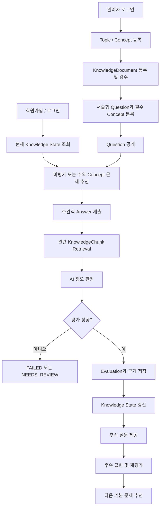

# CrackCS 제품 기능 명세서

## 1. 참조 문서

이 명세서는 아래 문서의 합의 내용을 통합한다. 세부 정책이나 테이블 정의가 충돌하면 이 명세서의 범위를 먼저 따르고, 해당 원본 문서를 함께 수정한다.

- [필수 기능 명세](./functional-specification.md)
- [필수 도메인 모델 및 ERD](./domain-model-and-erd.md)
- [콘텐츠·AI 운영 정책](./content-and-ai-policy.md)
- [추가 확장 기능](./extension-features.md)

## 2. 제품 개요

CrackCS는 사용자가 CS와 Java 백엔드 주관식 문제에 답하면, 승인된 지식 문서를 근거로 AI가 정오를 판정하고 개인의 개념별 이해 상태를 갱신하는 학습 서비스다.

시스템은 단순 채점에서 끝나지 않고 다음 학습 행동까지 연결한다.

```text
문제 추천
   ↓
주관식 답변
   ↓
지식 문서 Retrieval
   ↓
AI 정오 판정
   ↓
개념별 Knowledge State 갱신
   ↓
후속 질문 또는 다음 문제 추천
```

## 3. 해결하려는 문제

### 사용자 문제

- CS 개념을 읽었지만 자신의 언어로 설명할 수 있는지 확인하기 어렵다.
- 정답을 외웠는지, 원리를 이해했는지 구분하기 어렵다.
- 어떤 개념이 약한지 스스로 누적 관리하기 어렵다.
- 문제 풀이 이후 무엇을 다시 공부해야 하는지 판단하기 어렵다.

### 운영 문제

- AI의 사전 지식만으로 채점하면 평가 근거와 재현성이 부족하다.
- AI가 문제와 평가 기준을 모두 자동 생성하면 오류를 발견할 독립 기준이 사라진다.
- Java·Spring·JPA 지식은 버전별로 달라질 수 있어 평가 근거의 기술 버전을 추적해야 한다.

## 4. 제품 목표

1. 사용자가 모든 문제에 서술형으로 답할 수 있다.
2. AI가 공개 상태의 KnowledgeDocument만 이용해 답변의 정오를 판정한다.
3. 정오 판정과 Concept별 평가 근거를 사용자에게 제공한다.
4. 유효한 평가만 회원·Concept 단위 Knowledge State에 반영한다.
5. 답변 결과에 따라 후속 질문 또는 다음 문제를 제공한다.
6. 관리자가 문제와 지식 문서를 등록·검수·공개할 수 있다.
7. 과거 답변, 평가 결과와 사용 근거를 재현할 수 있다.

## 5. 비목표

이번 필수 개발 범위에는 다음을 포함하지 않는다.

- 객관식, 복수 선택, 빈칸 채우기
- 코드 작성·실행 문제와 테스트 케이스 채점
- AI 생성 문제의 자동 공개
- 사용자 문제 게시 및 공개
- 소셜 로그인과 2단계 인증
- 학습 세션, 일일 목표, 알림, 북마크
- 랭킹, 댓글, 스터디 그룹
- 결제, 구독과 사용량 제한
- 추천 알고리즘 A/B 테스트

확장 범위는 [추가 확장 기능](./extension-features.md)에서 관리한다.

## 6. 대상 사용자

### 학습자

- CS 기초를 공부하는 취업 준비생
- Java·Spring·JPA 백엔드 면접을 준비하는 개발자
- 자신의 취약 개념을 주관식 답변으로 확인하고 싶은 사용자

### 관리자

- Topic과 Concept 체계를 관리한다.
- 지식 문서의 출처와 기술 버전을 검수한다.
- 문제, 모범 답안, 필수 Concept과 난이도를 관리한다.
- AI 평가 실패를 확인하고 콘텐츠를 개선한다.

## 7. 확정된 제품 결정

| 항목 | 결정 |
|---|---|
| 문제 형식 | 모든 문제는 서술형 주관식 |
| 초기 콘텐츠 | 관리자가 등록하고 검수한 문제 은행 |
| 초기 주제 | CS 기초, Java 21, Spring Boot 4.1.x, Spring Framework 7.0.x, Jakarta Persistence 3.2 |
| 인증 | 이메일·비밀번호 기반 LOCAL 계정 |
| 인증 상태 유지 | 동일 출처 웹 기준 HttpOnly 서버 세션, CSRF token 병행 |
| 비밀번호 정책 | 15~64자 passphrase, 제어 문자 금지, UTF-8 72 byte 이하 |
| 권한 | USER, ADMIN |
| 평가 우선순위 | 표현력보다 핵심 개념의 정오 판정 우선 |
| 평가 판정 | CORRECT, PARTIALLY_CORRECT, INCORRECT, NEEDS_REVIEW |
| 점수 | 판정에서 100, 50, 0으로 단순 변환 |
| 난이도 | 관리자가 BASIC, INTERMEDIATE, ADVANCED 중 지정 |
| AI 모델 | 설정으로 교체 가능하게 구현; 초기 후보는 GPT-5.6 Terra |
| 비즈니스 모델 | 후순위 |

## 8. 제품 범위

### P0 — 출시 필수

- 이메일 회원가입, 로그인, 로그아웃
- USER·ADMIN 권한 분리
- 관리자 페이지
- Topic·Concept 관리
- KnowledgeDocument 등록, 검수, 공개, 폐기
- KnowledgeChunk 생성과 Retrieval
- 서술형 Question 등록, 검수, 공개, 폐기
- QuestionConcept와 필수 여부·가중치 관리
- 추천 문제 조회
- Answer 제출과 이력 보존
- AI Evaluation과 Concept별 판정
- 평가 근거 조회
- Knowledge State 갱신과 조회
- 후속 질문 생성·답변·평가
- 최근 풀이·평가 이력 조회
- AI 평가 실패 조회

### P1 — 필수 출시 이후

- 이메일 소유 확인과 비밀번호 재설정
- 작성 중 답변 임시 저장
- 학습 세션과 목표
- AI 문제 초안과 관리자 승인
- 사용자 문제 제안과 관리자 승인

## 9. 전체 흐름



## 10. 기능 요구사항

### 10.1 인증과 권한

#### FR-AUTH-001 회원가입

- 사용자는 고유한 이메일, 비밀번호와 닉네임으로 가입한다.
- 비밀번호 원문은 저장하거나 로그에 남기지 않는다.
- 비밀번호는 안전한 단방향 해시로 저장한다.
- 가입 성공 시 Member와 LOCAL AuthAccount를 함께 생성한다.
- 동일 이메일의 LOCAL 계정이 있으면 가입을 거부한다.

완료 조건:

- 정상 입력으로 회원가입할 수 있다.
- 중복 이메일, 잘못된 이메일과 정책을 충족하지 못한 비밀번호는 거부된다.
- DB와 로그 어디에도 비밀번호 원문이 남지 않는다.

#### FR-AUTH-002 로그인·로그아웃

- 사용자는 이메일과 비밀번호로 로그인한다.
- 차단되거나 탈퇴한 Member는 로그인할 수 없다.
- 로그인 성공 후 USER 또는 ADMIN 권한을 식별할 수 있다.
- 로그아웃하면 기존 인증 상태를 더 사용할 수 없다.

#### FR-AUTH-003 관리자 인가

- `/admin` 화면과 관리자 API는 ADMIN만 접근할 수 있다.
- USER가 관리자 리소스에 접근하면 요청을 거부한다.
- 관리자 권한 검사는 화면 숨김이 아니라 서버에서 수행한다.

### 10.2 관리자 콘텐츠 관리

#### FR-ADMIN-001 Topic·Concept 관리

- 관리자는 상위 Topic과 하위 Topic을 등록·수정·조회할 수 있다.
- 관리자는 Topic에 Concept을 등록·수정·조회할 수 있다.
- 공개 문제나 Knowledge State가 참조하는 Topic·Concept은 물리 삭제하지 않고 비활성화한다.

#### FR-ADMIN-002 KnowledgeDocument 관리

- 관리자는 문서 제목, Topic, 출처 유형, 원문 URL, 원문 내용, 내부 문서 버전, 기술 버전과 라이선스 메모를 등록한다.
- 문서는 DRAFT, PUBLISHED, RETIRED 상태를 가진다.
- PUBLISHED 전에는 관리자 검수자와 검수 시각이 필요하다.
- PUBLISHED 문서만 Retrieval 대상으로 사용한다.
- 공개 문서를 수정할 때 기존 버전을 덮어쓰지 않고 새 document_version을 만든다.
- 새 버전을 공개하면 이전 공개본은 행과 Chunk를 보존한 채 RETIRED로 전환하고 새 버전만 Retrieval 후보가 된다.
- 과거 Evaluation은 평가 당시 KnowledgeChunk를 계속 참조한다.

#### FR-ADMIN-003 KnowledgeChunk 생성

- 시스템은 KnowledgeDocument를 Retrieval 가능한 KnowledgeChunk로 분할한다.
- Chunk는 원문 문서, 문서 안 순서와 내용을 가진다.
- 임베딩 생성 실패 시 문서 공개 또는 검색 가능 상태를 명확히 구분한다.
- 같은 문서 버전을 중복 분할해 중복 Chunk를 만들지 않는다.

#### FR-ADMIN-004 Question 관리

- 관리자는 서술형 문제 본문, Topic, 모범 답안, 난이도와 상태를 관리한다.
- 일반 Question은 하나 이상의 QuestionConcept를 가져야 한다.
- QuestionConcept마다 필수 여부와 평가 가중치를 지정한다.
- QuestionConcept 가중치는 `(0, 1]` 범위의 소수 둘째 자리 값이며 공개 시 합계가 `1.00`이어야 한다.
- PUBLISHED Question만 학습자에게 제공한다.
- 이미 Answer가 존재하는 Question은 과거 의미가 바뀌도록 덮어쓰지 않는다.

#### FR-ADMIN-005 평가 실패 조회

- 관리자는 FAILED 또는 NEEDS_REVIEW Evaluation을 조회할 수 있다.
- 문제, 답변 ID, 실패 원인, 모델명, 평가 규칙 버전과 발생 시각을 확인할 수 있다.
- 관리자 화면에서 답변 원문을 보여줄 때 개인정보 접근 권한을 확인한다.

### 10.3 문제 조회와 추천

#### FR-QUESTION-001 추천 문제 조회

- 시스템은 회원에게 한 개의 다음 기본 Question을 제공한다.
- 아직 평가되지 않은 Concept이 있으면 미평가 Concept 문제를 우선한다.
- 모두 평가되었다면 mastery_score가 낮은 Concept 문제를 우선한다.
- 같은 우선순위에서는 최근에 풀지 않은 Question을 우선한다.
- 추천 후보가 없으면 사용자에게 콘텐츠 부족 상태를 명확히 표시한다.

#### FR-QUESTION-002 문제 표시

- 학습자는 Topic, 난이도, 문제 본문을 확인한다.
- 모범 답안, QuestionConcept, 평가 가중치는 제출 전에 공개하지 않는다.
- Question이 RETIRED되더라도 기존 Answer 이력에서는 문제 본문을 조회할 수 있다.

### 10.4 답변 제출과 이력

#### FR-ANSWER-001 Answer 제출

- 로그인한 사용자는 자신에게 제공된 Question에 서술형 Answer를 제출한다.
- 공백 답변과 최대 길이를 초과한 답변은 거부한다.
- 제출 성공 시 Answer 원문과 제출 시각을 먼저 저장한다.
- 제출된 Answer는 수정하지 않는다.
- 같은 문제를 다시 풀면 새로운 Answer를 생성한다.

#### FR-ANSWER-002 중복 제출 방지

- 네트워크 재시도로 같은 제출 요청이 반복되어도 Answer와 Evaluation이 중복 생성되지 않아야 한다.
- 클라이언트 요청 식별자 또는 동등한 멱등성 방법을 사용한다.

#### FR-ANSWER-003 답변 이력

- 학습자는 자신이 제출한 Answer 목록을 최신순으로 조회한다.
- 각 Answer에서 Question, 제출 시각, Evaluation 상태와 판정을 확인한다.
- 다른 회원의 Answer는 조회할 수 없다.

### 10.5 Retrieval과 AI 평가

#### FR-EVAL-001 평가 시작

- Answer 저장 후 Evaluation을 EVALUATING 상태로 생성한다.
- 평가는 Answer 저장 트랜잭션과 분리할 수 있지만 Answer를 유실하면 안 된다.
- 클라이언트는 평가 진행 상태를 확인할 수 있다.

#### FR-EVAL-002 평가 근거 검색

- Question의 Topic과 QuestionConcept로 PUBLISHED KnowledgeDocument 후보를 제한한다.
- 질문, 모범 답안과 사용자 Answer를 이용해 관련 KnowledgeChunk를 검색한다.
- 평가에 실제 사용한 Chunk는 EvaluationEvidence로 저장한다.
- 검색 근거가 없거나 서로 충돌하면 NEEDS_REVIEW로 처리한다.

#### FR-EVAL-003 구조화 평가

- AI 결과는 사전에 정의한 JSON 스키마로 검증한다.
- 결과에는 전체 verdict, Concept별 verdict, 강점, 누락, 오개념과 근거 Chunk ID가 포함된다.
- 서버는 verdict에서 점수를 계산하며 AI가 임의의 최종 점수를 확정하지 않는다.
- 출력 스키마가 잘못되거나 필수 Concept 판정이 누락되면 평가 실패로 처리한다.

#### FR-EVAL-004 정오 판정

| 판정 | 조건 | 점수 |
|---|---|---:|
| CORRECT | 모든 필수 Concept이 맞고 치명적 오개념이 없음 | 100 |
| PARTIALLY_CORRECT | 핵심 방향은 맞지만 필수 Concept 일부가 누락됨 | 50 |
| INCORRECT | 핵심 Concept이 틀렸거나 질문에 답하지 못함 | 0 |
| NEEDS_REVIEW | 근거 부족 또는 AI 판정 불확실 | 미반영 |

- 문장 길이와 전문 용어의 수만으로 정답 판정을 높이지 않는다.
- 표현력과 면접 전달력은 피드백할 수 있지만 정오 판정보다 낮은 우선순위로 둔다.

#### FR-EVAL-005 평가 완료와 실패

- 성공한 Evaluation은 EVALUATED 상태가 된다.
- 외부 AI 오류, 시간 초과와 스키마 검증 실패는 제한된 횟수만 재시도한다.
- 최종 실패 시 FAILED 상태와 진단 가능한 실패 원인을 저장한다.
- FAILED와 NEEDS_REVIEW 결과는 Knowledge State를 변경하지 않는다.

### 10.6 Knowledge State

#### FR-KNOWLEDGE-001 Concept별 상태 갱신

- Knowledge State는 Member와 Concept 조합별로 하나만 존재한다.
- 유효한 EvaluationConcept만 현재 상태에 반영한다.
- 미평가 Concept의 mastery_score는 0이 아니라 NULL이다.
- 같은 Evaluation이 두 번 반영되지 않아야 한다.
- 동시 갱신 충돌로 평가 하나가 유실되지 않아야 한다.

#### FR-KNOWLEDGE-002 상태 구분

- UNKNOWN: 유효한 평가가 없음
- LEARNING: 평가 이력이 있지만 숙련 또는 신뢰 기준을 충족하지 못함
- STABLE: 숙련과 신뢰 기준을 충족함

LEARNING과 STABLE의 정확한 임계값은 구현 전 확정하고 알고리즘 버전으로 관리한다.

#### FR-KNOWLEDGE-003 지식 지도 조회

- 학습자는 Topic별 집계 상태와 Concept별 상세 상태를 조회한다.
- 미평가와 취약 상태를 시각적으로 구분한다.
- Concept별 mastery_score, confidence_score, 평가 횟수와 마지막 평가 시각을 제공한다.

### 10.7 후속 질문

#### FR-FOLLOWUP-001 후속 질문 생성

- 일반 Question의 평가가 성공하면 후속 Question을 최대 한 개 생성한다.
- 정답이 아니면 가장 중요한 누락 또는 오개념 Concept을 확인한다.
- 정답이면 동일 Concept을 사례에 적용하는 심화 질문을 제공한다.
- 후속 Question은 원본 Answer를 source_answer_id로 참조한다.
- FAILED 또는 NEEDS_REVIEW 평가에서는 후속 질문을 만들지 않는다.

#### FR-FOLLOWUP-002 후속 답변

- 후속 Question도 일반 Question과 동일하게 Answer와 Evaluation을 생성한다.
- 후속 Question에 대한 두 번째 후속 Question은 생성하지 않는다.
- 후속 평가 완료 후 다음 기본 Question을 추천한다.

### 10.8 학습 현황

#### FR-PROGRESS-001 학습 홈

- 전체 풀이 수와 최근 평가 결과를 제공한다.
- Topic별 현재 상태를 제공한다.
- 현재 가장 우선해서 학습할 Concept을 제공한다.
- 추천 Question과 추천 이유를 제공한다.

## 11. 화면 요구사항

### 공개 화면

- 회원가입
- 로그인

### 학습자 화면

- 학습 홈
- 추천 문제 풀이
- 평가 진행 상태
- 평가 결과와 근거
- 후속 질문 풀이
- 지식 지도
- 답변·평가 이력

### 관리자 화면

- 관리자 대시보드
- 회원 목록 및 상태 관리
- Topic·Concept 관리
- KnowledgeDocument·Chunk 관리
- Question·QuestionConcept 관리
- 평가 실패 및 NEEDS_REVIEW 목록

## 12. API URI

### 공통 규칙

- 모든 제품 API의 base path는 `/api`이다.
- URI는 복수형 명사를 사용하고 trailing slash를 붙이지 않는다.
- 요청과 응답 본문은 JSON을 사용한다. Phase 3에서는 문서 원문을 `content` 문자열로 받으며, 대용량 파일 upload 방식은 도입 전에 별도 확정한다.
- 목록 API는 `page`, `size`, `sort` query parameter를 공통으로 사용한다. `page`는 0부터 시작하고 기본값은 0, `size` 기본값은 20이며 최댓값은 100이다. 응답은 `content`, `page`, `size`, `totalElements`, `totalPages`를 사용한다.
- ID path variable은 도메인을 드러내는 `memberId`, `questionId`, `answerId` 형태를 사용한다.
- `review`, `publish`, `retire`처럼 도메인 상태를 바꾸는 명령은 `POST` 하위 URI로 표현한다.
- 인증이 필요한 리소스는 세션 또는 확정된 인증 수단으로 현재 회원을 식별한다. 클라이언트가 임의의 memberId를 보내 소유자를 선택하지 않는다.
- 접근 권한 표기의 `USER`는 ADMIN도 접근할 수 있음을 포함한다.

### 시스템과 인증

| Method | URI | 권한 | 성공 응답 | 목적 |
|---|---|---|---|---|
| GET | `/api/health` | PUBLIC | 200 | 프런트 연결과 기본 상태 확인 |
| POST | `/api/auth/sign-up` | PUBLIC | 201 | LOCAL 회원가입 |
| POST | `/api/auth/login` | PUBLIC | 200 | 이메일·비밀번호 로그인 |
| POST | `/api/auth/logout` | USER | 204 | 현재 인증 상태 무효화 |
| GET | `/api/members/me` | USER | 200 | 현재 회원과 역할 조회 |

### 학습자 문제·답변·평가

| Method | URI | 권한 | 성공 응답 | 목적 |
|---|---|---|---|---|
| GET | `/api/questions` | USER | 200 | 공개 문제 목록 조회 |
| GET | `/api/questions/{questionId}` | USER | 200 | 공개 문제 상세 조회 |
| GET | `/api/recommendations/next-question` | USER | 200 | 다음 기본 문제와 추천 이유 조회 |
| POST | `/api/questions/{questionId}/answers` | USER | 202 | 답변 저장과 평가 시작 |
| GET | `/api/members/me/answers` | USER | 200 | 내 답변·평가 이력 목록 |
| GET | `/api/answers/{answerId}` | USER | 200 | 내 답변 상세 조회 |
| GET | `/api/answers/{answerId}/evaluation` | USER | 200 | 평가 상태·결과·근거 조회 |
| GET | `/api/answers/{answerId}/follow-up-question` | USER | 200 | 답변에서 생성된 후속 질문 조회 |
| GET | `/api/members/me/knowledge-states` | USER | 200 | Topic·Concept별 지식 상태 조회 |
| GET | `/api/members/me/progress` | USER | 200 | 학습 홈 요약 조회 |

`GET /api/questions`는 `topicId`, `difficulty`, `page`, `size`, `sort`를 선택적으로 받는다. Phase 1 개발 중에는 문제 조회 두 URI를 임시 PUBLIC으로 사용할 수 있지만, Phase 2 완료 전에 USER 권한으로 전환한다.

`POST /api/questions/{questionId}/answers`는 `Idempotency-Key` 요청 헤더를 필수로 받는다. 성공 응답에는 `answerId`, `evaluationId`와 초기 평가 상태를 포함한다. 같은 회원이 같은 key와 같은 요청을 다시 보내면 기존 결과를 반환하고, 같은 key로 다른 본문을 보내면 `409 Conflict`를 반환한다.

`GET /api/answers/{answerId}`, 평가와 후속 질문 URI는 현재 회원이 소유한 Answer에만 접근할 수 있다. 존재하지 않는 Answer와 다른 회원의 Answer를 외부에서 구분할 필요가 없으면 모두 `404 Not Found`로 처리해 소유권 정보를 숨긴다.

### 관리자 회원·분류

| Method | URI | 권한 | 성공 응답 | 목적 |
|---|---|---|---|---|
| GET | `/api/admin/members` | ADMIN | 200 | 회원 목록 조회 |
| PATCH | `/api/admin/members/{memberId}/status` | ADMIN | 200 | 회원 상태 변경 |
| GET | `/api/admin/topics` | ADMIN | 200 | Topic 목록 조회 |
| POST | `/api/admin/topics` | ADMIN | 201 | Topic 등록 |
| GET | `/api/admin/topics/{topicId}` | ADMIN | 200 | Topic 상세 조회 |
| PATCH | `/api/admin/topics/{topicId}` | ADMIN | 200 | Topic 수정 |
| POST | `/api/admin/topics/{topicId}/deactivate` | ADMIN | 204 | Topic 비활성화 |
| GET | `/api/admin/concepts` | ADMIN | 200 | Concept 목록 조회 |
| POST | `/api/admin/concepts` | ADMIN | 201 | Concept 등록 |
| GET | `/api/admin/concepts/{conceptId}` | ADMIN | 200 | Concept 상세 조회 |
| PATCH | `/api/admin/concepts/{conceptId}` | ADMIN | 200 | Concept 수정 |
| POST | `/api/admin/concepts/{conceptId}/deactivate` | ADMIN | 204 | Concept 비활성화 |

Concept 목록은 `topicId`, `active`, `page`, `size`, `sort`를 선택적으로 받는다. Topic 목록은 `parentId`, `active`, `page`, `size`, `sort`를 선택적으로 받는다.

### 관리자 KnowledgeDocument

| Method | URI | 권한 | 성공 응답 | 목적 |
|---|---|---|---|---|
| GET | `/api/admin/knowledge-documents` | ADMIN | 200 | 문서 목록 조회 |
| POST | `/api/admin/knowledge-documents` | ADMIN | 201 | 최초 DRAFT 문서 등록 |
| GET | `/api/admin/knowledge-documents/{documentId}` | ADMIN | 200 | 문서 상세 조회 |
| PATCH | `/api/admin/knowledge-documents/{documentId}` | ADMIN | 200 | DRAFT 문서 수정 |
| POST | `/api/admin/knowledge-documents/{documentId}/versions` | ADMIN | 201 | 기존 문서 기반 새 DRAFT 버전 생성 |
| POST | `/api/admin/knowledge-documents/{documentId}/review` | ADMIN | 200 | 문서 검수 완료 |
| POST | `/api/admin/knowledge-documents/{documentId}/publish` | ADMIN | 200 | 문서 공개 |
| POST | `/api/admin/knowledge-documents/{documentId}/retire` | ADMIN | 200 | 문서 폐기 상태 전환 |
| POST | `/api/admin/knowledge-documents/{documentId}/chunks` | ADMIN | 202 | Chunk·embedding 생성 작업 시작 |
| GET | `/api/admin/knowledge-documents/{documentId}/chunks` | ADMIN | 200 | 문서 Chunk 목록과 생성 상태 조회 |

문서 목록은 `topicId`, `status`, `technologyVersion`, `page`, `size`, `sort`를 선택적으로 받는다. 상태 전이 명령은 현재 상태에서 허용되지 않으면 `409 Conflict`를 반환한다.

### 관리자 Question

| Method | URI | 권한 | 성공 응답 | 목적 |
|---|---|---|---|---|
| GET | `/api/admin/questions` | ADMIN | 200 | 문제 목록 조회 |
| POST | `/api/admin/questions` | ADMIN | 201 | DRAFT 문제 등록 |
| GET | `/api/admin/questions/{questionId}` | ADMIN | 200 | 문제와 평가 기준 상세 조회 |
| PATCH | `/api/admin/questions/{questionId}` | ADMIN | 200 | DRAFT 문제 수정 |
| PUT | `/api/admin/questions/{questionId}/concepts` | ADMIN | 200 | QuestionConcept 전체 교체 |
| POST | `/api/admin/questions/{questionId}/review` | ADMIN | 200 | 문제 검수 완료 |
| POST | `/api/admin/questions/{questionId}/publish` | ADMIN | 200 | 문제 공개 |
| POST | `/api/admin/questions/{questionId}/retire` | ADMIN | 200 | 문제 폐기 상태 전환 |
| POST | `/api/admin/questions/{questionId}/versions` | ADMIN | 201 | 공개 문제 기반 새 DRAFT 버전 생성 |

문제 목록은 `topicId`, `status`, `difficulty`, `origin`, `page`, `size`, `sort`를 선택적으로 받는다. QuestionConcept를 전체 교체하는 `PUT`은 DRAFT 문제에서만 허용하고, 공개된 문제의 의미 변경은 새 버전 생성 정책을 따른다. 새 버전 공개 시 이전 공개본은 삭제하지 않고 RETIRED로 전환한다.

### 관리자 Evaluation

| Method | URI | 권한 | 성공 응답 | 목적 |
|---|---|---|---|---|
| GET | `/api/admin/evaluations` | ADMIN | 200 | 평가 목록·실패 필터 조회 |
| GET | `/api/admin/evaluations/{evaluationId}` | ADMIN | 200 | 평가, Answer, Evidence와 실패 상세 조회 |

평가 목록은 `status`, `verdict`, `modelName`, `from`, `to`, `page`, `size`, `sort`를 선택적으로 받는다. FAILED는 `status=FAILED`, 검토 필요는 `verdict=NEEDS_REVIEW`로 조회한다.

### HTTP 상태와 오류

| 상황 | 상태 |
|---|---:|
| 조회·수정·상태 전이 성공 | 200 |
| 리소스 생성 성공 | 201 |
| 비동기 작업 접수 | 202 |
| 응답 본문 없는 성공 | 204 |
| 입력 형식·validation 실패 | 400 |
| 인증되지 않음 | 401 |
| 권한 없음 | 403 |
| 리소스 없음 또는 숨겨야 하는 타인 소유 리소스 | 404 |
| 중복·허용되지 않는 상태 전이·멱등 키 충돌 | 409 |
| 과도한 요청 | 429 |
| 외부 AI를 포함한 서버 내부 실패 | 500 또는 내부 오류 정책에 맞는 5xx |

세부 request/response DTO 필드와 example은 각 Phase의 API 구현 전에 계약 테스트와 함께 확정한다. URI나 메서드를 변경하려면 `spec.md`를 먼저 수정하고 `tasks.md`와 프런트 API client를 함께 갱신한다.

## 13. 도메인 책임

| 도메인 | 책임 |
|---|---|
| Member | 회원 상태와 USER·ADMIN 역할 |
| AuthAccount | LOCAL 이메일과 비밀번호 해시, 추후 인증 제공자 확장점 |
| Topic / Concept | 학습 지식 체계와 평가 최소 단위 |
| KnowledgeDocument / Chunk | 검수된 평가 근거와 검색 단위 |
| Question / QuestionConcept | 서술형 문제와 평가 대상 Concept·가중치 |
| Answer | 수정하지 않는 사용자 제출 사실 |
| Evaluation / EvaluationConcept | 특정 Answer에 대한 시점별 판정 이력 |
| EvaluationEvidence | 평가에 사용한 KnowledgeChunk 추적 |
| KnowledgeState | 여러 평가를 누적한 Member·Concept별 현재 상태 |

핵심 구분:

```text
EvaluationConcept = 과거 특정 답변의 변경되지 않는 평가 사실
KnowledgeState    = 여러 평가가 반영되며 변하는 현재 학습 상태
```

## 14. 기술 방향

### 현재 프로젝트 기준

- Backend: Java 21, Spring Boot 4.1.x, Spring MVC, Spring Data JPA
- Frontend: Vue 3, TypeScript, Vite, Element Plus
- Local database: H2
- Production database: 미확정; 벡터 검색을 사용할 경우 PostgreSQL + pgvector 우선 검토
- AI: 제공자와 모델을 설정으로 교체 가능한 평가 인터페이스
- Embedding: 초기 후보 `text-embedding-3-small`

### 의존 방향

```text
Web/API
   ↓
Application use case
   ↓
Domain
   ↑
Persistence / AI / Embedding adapter
```

도메인이 특정 AI SDK, HTTP 클라이언트나 벡터 DB 구현을 직접 알지 않게 한다. 그래야 모델과 저장소가 바뀌어도 정오 판정과 Knowledge State 규칙을 유지할 수 있다.

## 15. 비기능 요구사항

### 보안

- 비밀번호 원문 저장과 로깅 금지
- 서버 측 USER·ADMIN 권한 검사
- 다른 회원의 Answer·Evaluation·Knowledge State 접근 금지
- AI 프롬프트에서 사용자 Answer를 명령이 아닌 평가 대상 데이터로 격리
- API 키와 DB 비밀번호를 저장소에 커밋하지 않음
- 로그인과 AI 평가 API의 과도한 요청 제한

### 데이터 일관성

- Member와 LOCAL AuthAccount는 원자적으로 생성
- Answer는 Evaluation 실패와 무관하게 보존
- Evaluation 하나는 Knowledge State에 최대 한 번 반영
- Knowledge State 동시 갱신은 낙관적 잠금 또는 동등한 방식으로 보호
- 공개 콘텐츠는 과거 평가 의미가 바뀌도록 덮어쓰지 않음

### 성능 초기 목표

- AI 호출을 제외한 일반 API 응답 p95 500ms 이하
- 평가 작업 접수 응답 p95 1초 이하
- AI 평가 완료 p95 20초 이하를 목표로 측정
- 지식 지도 조회 시 회원의 전체 Answer 이력을 매번 재계산하지 않음

### 관측 가능성

- requestId, memberId, answerId, evaluationId를 연결해 추적
- Retrieval 시간, 후보 Chunk 수와 사용 Chunk ID 기록
- AI 모델명, 평가 규칙 버전, 호출 시간과 실패 원인 기록
- 비밀번호와 답변 원문은 일반 애플리케이션 로그에서 제외

## 16. AI 품질 검증

### 골든 평가 세트

초기 Topic별로 관리자가 다음 답변 사례를 준비한다.

- 명확한 정답
- 핵심 일부가 빠진 부분 정답
- 자연스럽지만 핵심이 틀린 오답
- 질문과 무관한 답변
- 용어는 다르지만 의미가 같은 정답
- 평가 근거가 부족해 NEEDS_REVIEW가 되어야 하는 답변

### 출시 품질 목표

아래 수치는 초기 제안이며 대표 답안 세트가 준비되면 확정한다.

- CORRECT / PARTIALLY_CORRECT / INCORRECT 판정 일치율 85% 이상
- CORRECT와 INCORRECT의 이진 구분 정확도 90% 이상
- 명백한 오답을 CORRECT로 판정하는 비율 5% 이하
- EVALUATED 결과의 EvaluationEvidence 연결률 100%
- JSON 스키마 검증 성공률 99% 이상

모델 선택은 가격이나 일반 벤치마크가 아니라 이 평가 세트의 정확도, 지연과 비용을 함께 비교해 결정한다.

## 17. 개발 계획

기능을 단순한 수직 흐름부터 점진적으로 확장하는 구현 순서, Phase별 기술 도입 시점과 검증 기준은 [개발 계획](./plan.md)에서 관리한다.

## 18. 테스트 전략

### 단위 테스트

- verdict → score 변환
- Knowledge State 상태 전이
- 추천 우선순위
- Question 공개 조건
- 문서·문제 상태 전이

### 통합 테스트

- 회원가입과 LOCAL AuthAccount 원자성
- USER·ADMIN 인가
- Answer 저장 후 Evaluation 생성
- 평가 성공 시에만 Knowledge State 반영
- 동일 Evaluation 중복 반영 방지
- PUBLISHED 문서만 Retrieval에 포함

### 계약 테스트

- AI Structured Output JSON 스키마
- Embedding/AI 제공자 오류 변환
- 모델 교체 후 동일 평가 인터페이스 유지

### E2E 테스트

- 관리자 콘텐츠 작성·검수·공개
- 회원가입·로그인·문제 풀이·평가 확인
- 후속 질문 답변과 다음 문제 추천
- 다른 회원 데이터 접근 차단

## 19. 핵심 인수 시나리오

### AC-001 최초 학습

```text
Given 로그인한 회원의 모든 Concept이 UNKNOWN이고
When 추천 문제를 조회하면
Then 시스템은 미평가 Concept을 포함한 PUBLISHED Question을 반환한다.
```

### AC-002 정상 평가

```text
Given PUBLISHED Question과 관련 KnowledgeDocument가 있고
When 회원이 유효한 서술형 Answer를 제출하면
Then Answer가 보존되고 Evaluation이 생성되며
And 평가 완료 후 전체·Concept별 verdict와 근거가 제공되고
And Knowledge State가 정확히 한 번 갱신된다.
```

### AC-003 평가 실패

```text
Given Answer가 저장되었고
When AI 호출 또는 출력 검증이 최종 실패하면
Then Evaluation은 FAILED가 되고
And Answer는 보존되며
And Knowledge State는 변경되지 않는다.
```

### AC-004 미평가와 취약 구분

```text
Given DNS는 평가한 적이 없고 TCP는 INCORRECT로 평가되었을 때
When 지식 지도를 조회하면
Then DNS는 UNKNOWN이고 mastery_score는 NULL이며
And TCP는 LEARNING이고 평가 이력이 표시된다.
```

### AC-005 후속 질문

```text
Given 일반 Question의 평가가 EVALUATED 상태일 때
When 평가 결과를 확인하면
Then 시스템은 누락 보강 또는 심화 후속 Question을 최대 한 개 제공하고
And 후속 답변 평가 후에는 추가 후속 질문 없이 다음 기본 문제를 추천한다.
```

### AC-006 관리자 권한

```text
Given USER 권한으로 로그인했을 때
When 관리자 페이지 또는 관리자 API에 접근하면
Then 서버가 요청을 거부하고 관리자 데이터가 노출되지 않는다.
```

### AC-007 콘텐츠 버전

```text
Given PUBLISHED KnowledgeDocument를 새 내용으로 갱신할 때
When 관리자가 새 버전을 공개하면
Then 기존 문서 버전과 Chunk는 보존되고
And 과거 Evaluation은 기존 근거를 계속 참조하며
And 새로운 Evaluation만 새 문서 버전을 사용할 수 있다.
```

## 20. 위험과 대응

| 위험 | 영향 | 대응 |
|---|---|---|
| AI가 자연스러운 오답을 정답으로 판정 | 잘못된 학습 상태 형성 | 골든 세트, 필수 Concept, NEEDS_REVIEW, 관리자 실패 조회 |
| Retrieval이 관련 없는 문서를 제공 | 판정 근거 오염 | Topic·Concept 선필터, Evidence 저장, Recall@K 평가 |
| 관리자 콘텐츠 병목 | 문제 수 부족 | 초기 품질 기준 확보 후 AI DRAFT 도입 검토 |
| 프레임워크 버전 혼합 | 같은 질문에 상충하는 답 | technology_version 필수화, 문서 버전 보존 |
| AI 비용 증가 | 운영 지속성 저하 | 모델 설정화, 입력 문서 제한, 검증 후 저비용 모델 전환 |
| 비동기 평가 중복 처리 | Knowledge State 중복 갱신 | 멱등 키, Evaluation 유일성, 적용 이벤트 중복 방지 |
| 인증 정보 유출 | 계정 탈취 | 강한 해시, 비밀정보 분리, 로그 마스킹, 접근 제한 |

## 21. 미결정 사항

| ID | 결정 필요 항목 | 결정 시점 | 기본 제안 |
|---|---|---|---|
| OQ-001 | 서버 세션과 토큰 중 인증 상태 유지 방식 | 결정 | 동일 출처 웹의 HttpOnly 서버 세션과 CSRF token 사용 ([ADR-0001](./adr/0001-session-based-authentication.md)) |
| OQ-002 | Production DB와 벡터 저장 방식 | Phase 0 | PostgreSQL + pgvector 우선 검토 |
| OQ-003 | PARTIALLY_CORRECT Concept 충족 기준 | 골든 세트 작성 후 | 필수 Concept 누락과 오개념을 분리해 판정 |
| OQ-004 | Knowledge State 갱신 공식과 STABLE 임계값 | Phase 3 전 | 버전 필드를 두고 초기에는 단순 가중 평균 |
| OQ-005 | AI 평가 동기·비동기 실행 방식 | Phase 2 전 | Answer 저장 후 비동기 평가 우선 검토 |
| OQ-006 | 초기 Topic별 문제·문서 최소 수 | 콘텐츠 입력 전 | 하위 Topic별 공개 문제 5개 이상으로 파일럿 |
| OQ-007 | AI 생성 문제 기능 도입 시점 | P0 출시 후 | 골든 세트와 관리자 검수 처리량 확인 후 결정 |
| OQ-008 | 비밀번호 최소 길이와 복잡도 정책 | 결정 | 15~64자 passphrase, 제어 문자 금지, UTF-8 72 byte 이하 ([ADR-0002](./adr/0002-password-policy.md)) |

## 22. P0 완료 정의

다음 조건을 모두 충족하면 필수 제품 개발이 완료된 것으로 본다.

- ADMIN이 지식 문서와 서술형 문제를 등록·검수·공개할 수 있다.
- USER가 이메일로 가입·로그인하여 추천 문제를 풀 수 있다.
- Answer가 승인 문서를 근거로 평가되고 전체·Concept별 verdict를 제공한다.
- EvaluationEvidence를 통해 평가 근거를 재현할 수 있다.
- 유효한 평가만 Knowledge State에 정확히 한 번 반영된다.
- UNKNOWN과 취약 Concept이 구분된다.
- 후속 질문 답변 후 다음 기본 문제로 이어진다.
- 다른 회원 데이터와 관리자 기능에 대한 접근이 차단된다.
- 골든 평가 세트와 P0 인수 시나리오를 통과한다.
- 코드 작성 문제, 사용자 문제 게시와 결제 기능이 P0에 섞이지 않는다.
